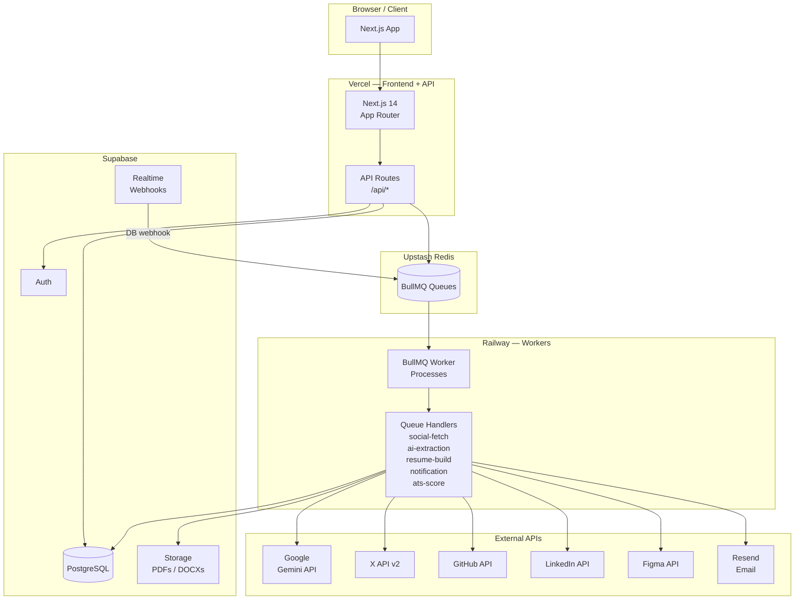
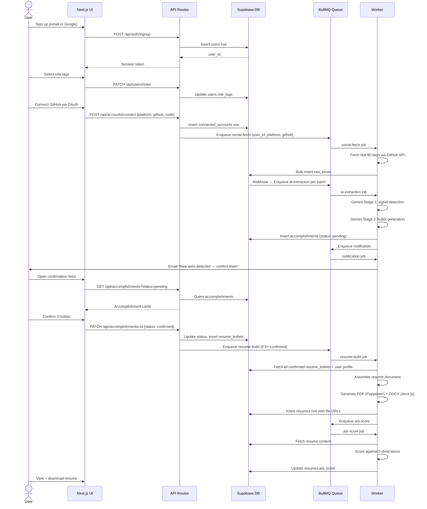
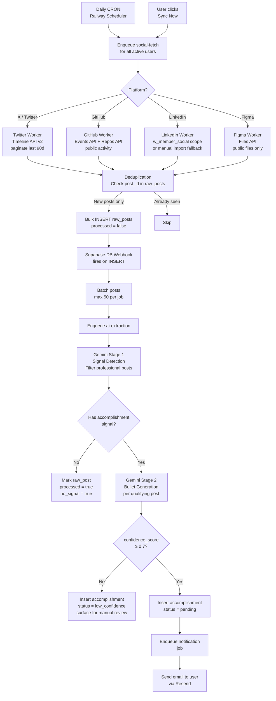
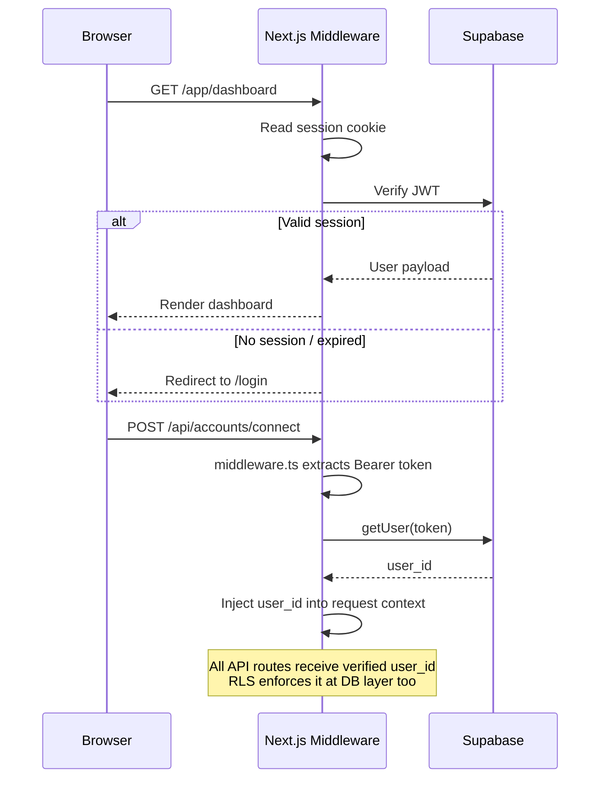

# Tracck — System Design Document

**Version:** 1.0  
**Status:** Draft  
**Date:** June 2026

---

## 1. Overview

Tracck is a multi-service web application split across three deployment targets:

| Target | Service | Runtime |
|--------|---------|---------|
| Vercel | Next.js 14 frontend + API Routes | Node.js 20 |
| Railway | BullMQ worker processes | Node.js 20 |
| Supabase | PostgreSQL database + Auth + Storage | Managed |

External dependencies: Google Gemini API, X API v2, GitHub API, LinkedIn API, Figma API, Upstash Redis, Resend.

---

## 2. High-Level Architecture



---

## 3. Component Breakdown

### 3.1 Next.js Frontend (Vercel)

**Role:** UI rendering, user-facing API, OAuth callback handling, session management.

```
app/
├── (auth)/
│   ├── login/page.tsx
│   └── callback/[provider]/page.tsx   ← OAuth return landing
├── (app)/
│   ├── dashboard/page.tsx
│   ├── accounts/page.tsx              ← Connect social accounts
│   ├── accomplishments/page.tsx       ← Confirmation feed
│   ├── resume/
│   │   ├── page.tsx                   ← Live resume preview
│   │   └── [version]/page.tsx
│   └── settings/page.tsx
├── api/
│   ├── auth/[...supabase]/route.ts
│   ├── accounts/route.ts
│   ├── accomplishments/route.ts
│   ├── resumes/route.ts
│   └── jobs/trigger/route.ts
└── middleware.ts                       ← Auth guard on /app/*
```

**Middleware:** All `/app/*` routes check Supabase session. Redirect to `/login` if unauthenticated.

### 3.2 BullMQ Workers (Railway)

**Role:** All async, long-running, or rate-limited work. Completely decoupled from the UI.

```
workers/
├── index.ts                 ← Worker bootstrap, connects to Upstash Redis
├── queues.ts                ← Queue definitions (shared with API routes)
├── jobs/
│   ├── social-fetch.ts      ← Pulls posts from social platforms
│   ├── ai-extraction.ts     ← Runs Gemini signal detection + bullet gen
│   ├── resume-build.ts      ← Assembles resume, generates PDF/DOCX
│   ├── notification.ts      ← Sends email/push on new accomplishments
│   └── ats-score.ts         ← Scores resume after build
└── lib/
    ├── platforms/           ← Per-platform fetch adapters
    │   ├── twitter.ts
    │   ├── github.ts
    │   ├── linkedin.ts
    │   └── figma.ts
    ├── gemini.ts            ← Google Gemini wrapper
    └── resume-export.ts     ← Puppeteer (PDF) + docx-js (DOCX)
```

### 3.3 Supabase

**Role:** Primary datastore, auth, file storage, and change-event source.

- **Auth:** Supabase Auth with email/password + Google OAuth. JWTs passed in `Authorization` header to API routes.
- **Database:** PostgreSQL 15. Row Level Security enforces user data isolation at the DB layer.
- **Storage:** Two buckets — `resumes` (private, user-scoped) and `exports` (signed URLs for downloads).
- **Webhooks:** Database webhooks fire on `raw_posts` INSERT → POST to a Railway webhook endpoint → enqueues `ai-extraction` job.

### 3.4 Upstash Redis + BullMQ

**Role:** Durable job queue with retry, delay, and priority support.

Queues:

| Queue | Concurrency | Max Retries | Backoff |
|-------|-------------|-------------|---------|
| `social-fetch` | 5 | 3 | Exponential 30s |
| `ai-extraction` | 10 | 5 | Exponential 10s |
| `resume-build` | 3 | 3 | Fixed 15s |
| `notification` | 20 | 2 | Fixed 5s |
| `ats-score` | 5 | 3 | Exponential 10s |

---

## 4. Data Flow Diagrams

### 4.1 User Onboarding & First Resume



### 4.2 Social Fetch Pipeline (End-to-End)



### 4.3 Resume Build Pipeline

```mermaid
flowchart TD
    TRIGGER[resume-build job triggered<br/>on 3+ confirmed bullets] --> FETCH[Fetch from Supabase]

    FETCH --> PROFILE[users: name, email,<br/>location, role_tags]
    FETCH --> BULLETS[resume_bullets: all confirmed,<br/>ordered by position]
    FETCH --> SKILLS[skills: extracted + manual]
    FETCH --> EXP[User-entered experience<br/>education sections]

    PROFILE --> SUMMARY[Gemini Stage 3<br/>Generate 2-sentence summary<br/>based on role_tags + bullets]
    SUMMARY --> ASSEMBLE

    BULLETS --> ASSEMBLE[Assemble Resume Object<br/>in memory]
    SKILLS --> ASSEMBLE
    EXP --> ASSEMBLE

    ASSEMBLE --> ATSCHECK[ATS Compliance Check<br/>No tables / images / specials<br/>in content strings]

    ATSCHECK --> PDF[Puppeteer PDF<br/>Render headless HTML template<br/>→ PDF buffer]
    ATSCHECK --> DOCX[docx-js DOCX<br/>Programmatic .docx<br/>ATS-safe formatting]

    PDF --> STORE[Upload to Supabase Storage<br/>resumes/{user_id}/{version}/]
    DOCX --> STORE

    STORE --> DBROW[INSERT resumes row<br/>version++, pdf_url, docx_url]
    DBROW --> ATSJOB[Enqueue ats-score]

    ATSJOB --> SCORE[ATS Scoring Engine<br/>5 dimensions<br/>weighted average]
    SCORE --> UPDATE[UPDATE resumes.ats_score]
    UPDATE --> NOTIFY[Notify user<br/>Resume ready + score]
```

---

## 5. Authentication Flow



**Social OAuth flow (per platform):**

1. Browser → `GET /api/accounts/oauth/start?platform=github`
2. API generates state token, stores in Redis (TTL 10min)
3. Redirect to platform OAuth URL with `redirect_uri=/api/accounts/oauth/callback`
4. Platform redirects back with `code` + `state`
5. API validates state, exchanges code for access token
6. Store encrypted token in `connected_accounts.access_token`
7. Enqueue `social-fetch` job

---

## 6. Infrastructure Topology

```
┌─────────────────────────────────────────────────────────────┐
│  DNS: tracck.io → Vercel Edge Network                       │
│                                                             │
│  ┌─────────────────────────────────────────────────────┐   │
│  │  Vercel (Frontend + API)                            │   │
│  │  • Next.js 14 App Router (SSR + RSC)                │   │
│  │  • API Routes — serverless functions                 │   │
│  │  • Automatic HTTPS, CDN, edge caching               │   │
│  └─────────────────────┬───────────────────────────────┘   │
│                         │                                   │
│  ┌──────────────────────▼──────────────────────────────┐   │
│  │  Supabase (Managed PostgreSQL + Auth + Storage)     │   │
│  │  Region: africa-south1 (closest to NG)              │   │
│  │  • Connection pooling via Supavisor                  │   │
│  │  • Realtime webhooks → Railway                       │   │
│  └─────────────────────────────────────────────────────┘   │
│                                                             │
│  ┌─────────────────────────────────────────────────────┐   │
│  │  Railway (Workers)                                  │   │
│  │  • BullMQ worker processes (always-on)              │   │
│  │  • Webhook receiver endpoint                        │   │
│  │  • Daily CRON scheduler                             │   │
│  │  • Horizontal scaling per queue concurrency         │   │
│  └─────────────────────────────────────────────────────┘   │
│                                                             │
│  ┌─────────────────────────────────────────────────────┐   │
│  │  Upstash Redis (Serverless Redis)                   │   │
│  │  • BullMQ queue persistence                         │   │
│  │  • OAuth state tokens (TTL)                         │   │
│  │  • Rate limit counters per platform                  │   │
│  └─────────────────────────────────────────────────────┘   │
└─────────────────────────────────────────────────────────────┘
```

---

## 7. Key Design Decisions

| Decision | Choice | Rationale |
|----------|--------|-----------|
| Frontend hosting | Vercel | Zero-config Next.js, automatic edge deployment |
| Worker hosting | Railway | Always-on processes; BullMQ needs persistent connections |
| Queue backend | Upstash Redis | Serverless Redis with REST API; no infra to manage |
| Database | Supabase PostgreSQL | RLS for multi-tenancy, built-in auth, realtime webhooks |
| AI provider | Google Gemini (`gemini-flash-latest`) | Structured JSON output reliability, instruction following |
| PDF generation | Puppeteer on Railway | Server-side only; can't run in Vercel serverless |
| DOCX generation | docx-js | Pure Node.js, no LibreOffice dependency |
| Token encryption | AES-256-GCM in app layer | Don't rely solely on Supabase RLS for OAuth secrets |
| Social fetch cadence | Daily + on-demand | Balance freshness vs. API rate limits |
| LinkedIn fallback | Manual PDF import | LinkedIn API is too restricted for programmatic access |

---

## 8. Error Handling & Resilience

### Worker Error Strategy

```
Job fails
  └─ BullMQ retries (exponential backoff, see concurrency table)
       └─ Max retries exceeded
            └─ Job moved to {queueName}:failed
                 └─ Admin webhook → Slack alert
                      └─ Manual investigation via Bull Board UI
```

### Platform API Failures

- **Rate limit hit (429):** Job is delayed (not failed) until the rate limit window resets. Counter stored in Redis.
- **Auth token expired:** Job moves to `needs_reauth` state, user notified to reconnect account.
- **Platform API down:** Job retried with exponential backoff; after max retries, user notified.

### Gemini API Failures

- **Timeout > 30s:** Retry with same prompt up to 3 times.
- **Invalid JSON output:** Retry with stricter JSON-only system prompt.
- **Low confidence score (< 0.7):** Insert accomplishment as `low_confidence`, surface for manual user review rather than dropping.

---

## 9. Security Considerations

- **OAuth tokens** encrypted at rest with AES-256-GCM before storing in `connected_accounts`. Decryption key stored in Railway env, never in Supabase.
- **RLS policies** on every table ensure users can only read/write their own rows even if API is bypassed.
- **No private social data** stored. Only public post content fetched via public APIs.
- **Signed URLs** for resume downloads (Supabase Storage signed URLs, 1hr TTL).
- **CORS** restricted to `tracck.io` origin on all API routes.
- **Rate limiting** on API routes via Upstash Redis (`@upstash/ratelimit`) — 100 req/min per user.
